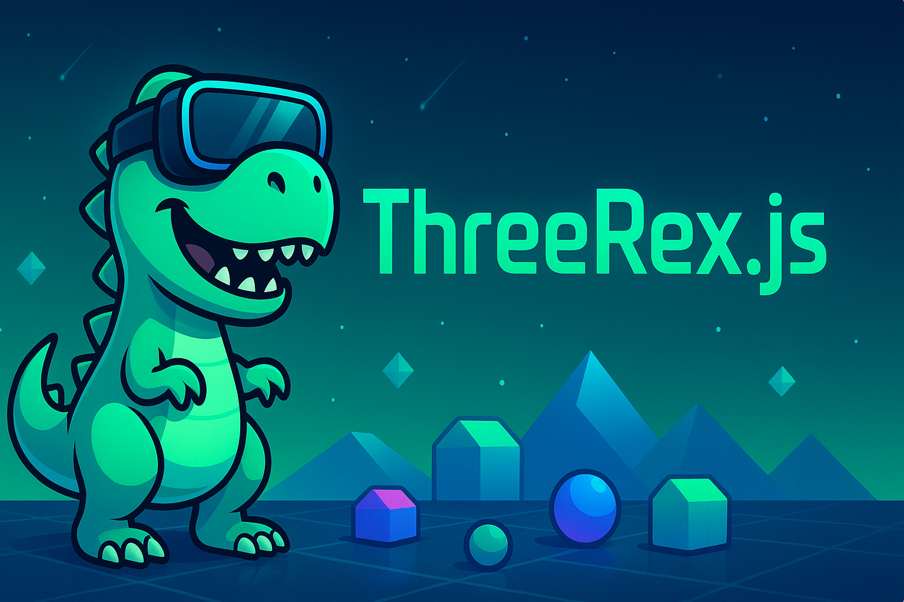

# 🦖 ThreeRex.js

**ThreeRex.js** — коллекция минимальных примеров на **Three.js**, где каждый семпл — как отдельный динозавр в доисторическом 3D-мире.

🌳 **Цель:** маленькие, понятные и красивые демо для освоения WebGL, 3D-сцен и анимации.

📂 Примеры лежат в `samples/`, каждая папка — отдельный проект (TS + Vite).

▶️ Локально: `npm i` → `npm run dev -- samples/cubes/sample-1`

🏗️ Сборка всех семплов: `npm run build` (артефакты попадут в `site/`).

🚀 GitHub Actions автоматически собирает и публикует сайт на Pages.

🤝 PR с новыми семплами приветствуются — добавь папку с `index.html` и `src/main.ts`.

🔗 **→ [Открыть сайт с семплами](https://alexander-topilskii.github.io/ThreeRexJs/)**

